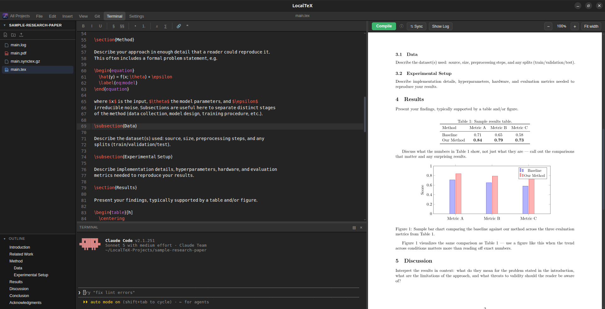

<div align="center">


# LocalTeX

**Overleaf's editing experience, running entirely on your own machine.**

A live LaTeX editor, a real compiler, and a real terminal — one window, no
cloud, no account, no multi-gigabyte TeX Live install.

[](LICENSE)
[](https://electronjs.org)
[](#install)
[](https://sayedshaun.github.io/localtex/)

[Docs](https://sayedshaun.github.io/localtex/) · [Install](#-install) · [Features](#-features) · [Uninstall](#-uninstall) · [Contributing](CONTRIBUTING.md)

</div>

<p align="center">
  
</p>

---

## Why LocalTeX?

Overleaf is great until you need it offline, want your files to actually
live on your disk, or just don't want to pay for compile priority on your
own laptop. LocalTeX gives you that same editor-plus-preview workflow,
backed by a real filesystem and a real shell, with nothing running outside
your machine.

## ✨ Features

| | |
|---|---|
| 🏠 **Multi-project dashboard** | An Overleaf-style home screen listing every project under `~/LocalTeX-Projects`, with search, new/delete, and .zip export/import (drop a project straight into Overleaf's "Upload Project", or pull one back out). |
| 📝 **Live editor** | CodeMirror 6 with LaTeX syntax highlighting, autosave, undo/redo, find/replace, a symbol toolbar, and a document outline that jumps the cursor to any section. |
| ⚙️ **Real compiler** | [Tectonic](https://tectonic-typesetting.github.io/) — a self-contained LaTeX engine, so there's no multi-gigabyte TeX Live install. Errors surface inline; the log only pops up when a compile actually fails. |
| 🔗 **SyncTeX** | Click "Sync" to jump the PDF to your cursor's position; double-click the PDF to jump the editor back — both directions, pixel-accurate. |
| 💻 **Real terminal** | A genuine PTY-backed shell (`node-pty`), not a simulation. Dockable to the bottom or side, resizable, closable without killing the session. |
| 📄 **PDF preview** | Rendered with `pdf.js` at supersampled resolution for crisp text. Foldable, resizable split view, plus Ctrl+scroll / touchpad-pinch zoom. |
| 🔍 **Project-wide search** | A VS Code-style search panel — find text across every file in a project, not just the open one. |
| 🗂️ **File tree** | Overleaf-style sidebar — create, rename, drag-and-drop move, and delete via right-click or empty-space click. Foldable and resizable. |
| 🎨 **Themes** | VS Code Dark, Dracula, GNOME, and Light — covers the editor, terminal, and app chrome. |
| 🌐 **Multilingual documents** | A bundled Bengali font plus a XeLaTeX + polyglossia starter template for mixing non-Latin scripts (Bengali, Arabic, Hindi, ...) with regular Latin text in the same document. |
| 🧭 **Menu bar** | File / Edit / Insert / View / Theme, with only commands that actually do something — no dead menu items. |

## 🚀 Install

> Debian/Ubuntu-based Linux (apt-based) and Windows 10/11 are supported.

### Linux

Grab the latest `.deb` from [Releases](https://github.com/sayedshaun/localtex/releases/latest)
and install it:

```bash
curl -fSLO https://github.com/sayedshaun/localtex/releases/latest/download/localtex.deb
sudo apt install ./localtex.deb
```

You'll also need [Tectonic](https://tectonic-typesetting.github.io/en-US/install.html)
on `PATH` to actually compile documents, if you don't have it already:

```bash
curl -fsSL https://drop-sh.fullyjustified.net | sh   # installs tectonic to ~/.local/bin
```

### Windows

Grab `localtex-setup.exe` from [Releases](https://github.com/sayedshaun/localtex/releases/latest)
and run it.

You'll also need [Tectonic](https://tectonic-typesetting.github.io/en-US/install.html)
on `PATH` to actually compile documents — grab the Windows binary from their
[install page](https://tectonic-typesetting.github.io/en-US/install.html) and
make sure it's on your `PATH`.

(Every tagged release's `.deb` and `.exe` are built and attached automatically
by [`.github/workflows/release.yml`](.github/workflows/release.yml).)

## 🗑️ Uninstall

**Linux**

```bash
sudo apt remove localtex
```

This only removes the `localtex` package. It won't touch your
`~/LocalTeX-Projects` project files or the standalone `tectonic` binary —
remove those yourself if you no longer need them:

```bash
rm -rf ~/LocalTeX-Projects
rm -f ~/.local/bin/tectonic
```

**Windows**

Uninstall LocalTeX from Windows Settings → Apps, same as any other app. It
won't touch your `LocalTeX-Projects` folder or your Tectonic install —
remove those yourself if you no longer need them.

## 🤝 Contributing

This is an open-source project — issues and pull requests are welcome. See
[CONTRIBUTING.md](CONTRIBUTING.md) for the development setup, build
instructions, and project layout.

## 📄 License

MIT © 2026 [Sayed Shaun](https://github.com/sayedshaun) — see [LICENSE](LICENSE) for the full text.
